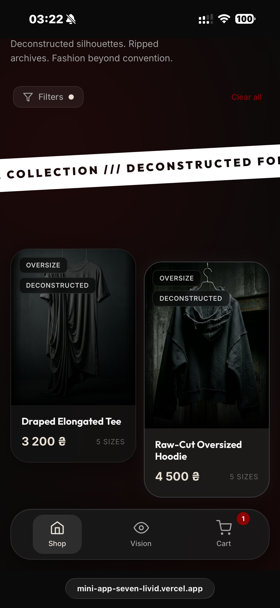
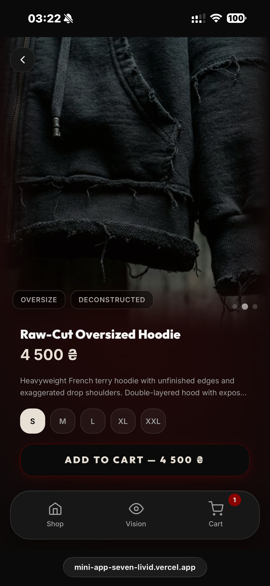
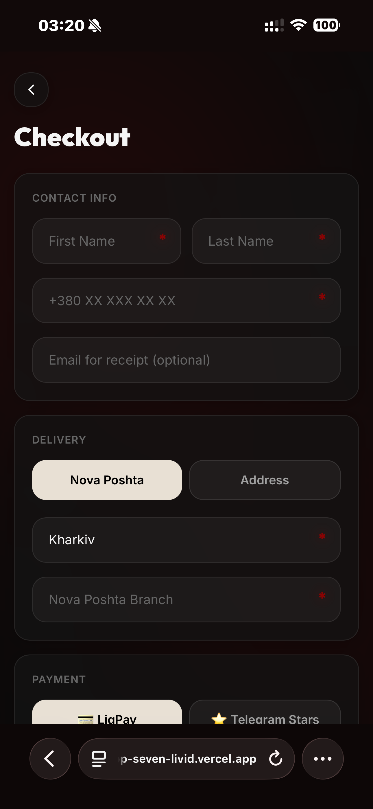

<div align="center">
  

  <h1>DECON</h1>
  <p><i>Telegram Mini App MVP for a premium clothing store experience</i></p>

  <p>
    
    
    
    
  </p>

  <p>
    <a href="https://t.me/archiveshmotbot"><b>Open on Telegram</b></a> •
    <a href="https://mini-app-seven-livid.vercel.app"><b>Live Demo</b></a>
  </p>
</div>

## Project Overview

DECON is a Telegram Mini App MVP for an independent fashion brand or boutique clothing store. It shows how a merchant can present a curated catalog, let customers browse and filter products, collect checkout details, and forward orders to a manager inside Telegram without building a full custom e-commerce platform.

This project is designed as a portfolio-ready prototype: visually polished, functionally complete for a demo, and honest about what is mock-based versus production-ready. It is a strong fit for freelance client conversations around Telegram commerce, launch prototypes, and branded shopping experiences inside messaging ecosystems.

The business problem it solves is simple: many small brands want a lightweight sales flow inside Telegram, where customers already communicate with the store team. DECON demonstrates that flow with a premium storefront, a practical checkout, and manager-facing order handoff through Telegram.

<table align="center" style="border-collapse: separate; border-spacing: 10px;">
  <tr>
    <td align="center" style="border: none;"><b>Home</b><br></td>
    <td align="center" style="border: none;"><b>Catalog</b><br></td>
    <td align="center" style="border: none;"><b>Checkout</b><br></td>
  </tr>
</table>

## Features

- Telegram Mini App storefront with Telegram WebApp integration for viewport setup, header styling, and haptic feedback.
- Product catalog with product detail pages, image galleries, sizes, styles, and stock visibility.
- Filter experience for product styles, sizes, and price range.
- Persistent cart built for a mobile-first Telegram browsing flow.
- Checkout form with contact details, delivery method selection, and payment method selection.
- Order forwarding to a manager via Telegram using the Bot API in `/api/checkout`.
- Demo-safe checkout mode when Telegram credentials are not configured.
- Mock logistics autocomplete for cities and Nova Poshta branches.
- Demo admin dashboard at `/admin` for portfolio presentation, with local product overrides and reset flow.
- Local persistence with Zustand so cart and admin demo state survive refreshes during a review session.

## Tech Stack

- React 19 + TypeScript
- Vite for the frontend build and local development
- Zustand for cart, filters, and local admin state
- Framer Motion for motion and interaction polish
- Tailwind CSS v4 utilities in the UI layer
- Vercel Serverless Functions for `/api/products`, `/api/locations`, and `/api/checkout`
- Telegram WebApp API for Mini App behavior and Telegram-native UX

## Architecture Overview

- Frontend: single-page React app rendered with Vite and routed with React Router.
- Catalog data: loaded from `/api/products`, with a local seeded fallback so the storefront still works when the API is unavailable in local preview.
- Logistics demo data: `/api/locations` returns mock city and branch suggestions used by checkout autocomplete.
- Checkout handoff: the frontend posts checkout payloads to `/api/checkout`; that endpoint formats the order and sends it to a configured Telegram chat through the Telegram Bot API.
- Admin/dashboard: `/admin` is a local prototype dashboard backed by Zustand persistence and `localStorage`, intended for demos rather than secure store operations.

## Environment Variables

Create a local `.env` file from `.env.example` and add the values below.

| Variable | What it does | Required |
| --- | --- | --- |
| `TELEGRAM_BOT_TOKEN` | Bot token used by `/api/checkout` to send order notifications through the Telegram Bot API. | Required for real Telegram order forwarding |
| `TELEGRAM_CHAT_ID` | Telegram user, group, or channel chat ID that receives new order messages from the bot. | Required for real Telegram order forwarding |

Behavior notes:

- If both variables are configured, successful checkout requests are forwarded to the manager in Telegram.
- If the variables are missing, checkout still works in demo mode and returns a transparent demo message instead of pretending to send a real Telegram notification.
- Do not commit your real `.env` file. This repository keeps only `.env.example` as a safe template.

## Local Setup

This repo uses `npm` (`package-lock.json` is included).

```bash
git clone https://github.com/makquella/clothes-shop.git
cd clothes-shop
npm install
cp .env.example .env
npm run dev
```

Useful scripts:

```bash
npm run typecheck
npm run build
```

Local development notes:

- `npm run dev` is enough to review the storefront UI, cart flow, and most of the client-side experience in a browser.
- In plain Vite local development, the Vercel serverless routes are not the primary runtime, so the catalog falls back to local seed data and checkout uses demo-safe behavior.
- For end-to-end testing of the serverless checkout route with Telegram forwarding, use a Vercel preview/production deployment or run the project with Vercel local tooling.

## Deployment

Vercel is the primary deployment target for this MVP.

1. Import the GitHub repository into Vercel.
2. Add `TELEGRAM_BOT_TOKEN` and `TELEGRAM_CHAT_ID` in the Vercel project environment settings.
3. Deploy the project. The existing `vercel.json` rewrites support both the SPA frontend and the `/api/*` serverless routes.
4. Open the deployed URL and verify the catalog, checkout, and `/admin` demo route.
5. In BotFather, set the Telegram bot menu button or Mini App URL to the deployed frontend URL.
6. Test a checkout to confirm the order is forwarded to the manager chat in Telegram.

## Portfolio Notes / MVP Limitations

- This is an MVP / prototype meant for portfolio presentation and early client validation, not a production SaaS platform.
- Product catalog data is currently seeded in the codebase rather than managed by a database or external CMS.
- Delivery autocomplete is mock/demo-based and is included to demonstrate UX flow, not live carrier integration.
- The admin/dashboard flow is intentionally demo-only and uses a simplified local passcode gate. It should not be presented as production authentication.
- Admin changes are stored in local browser state for demo purposes and are not shared across devices or team members.
- Checkout forwards order details to a manager in Telegram, but it does not implement a production-grade payment, fulfillment, or order management backend.
