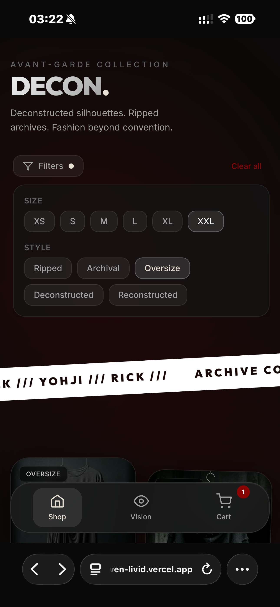
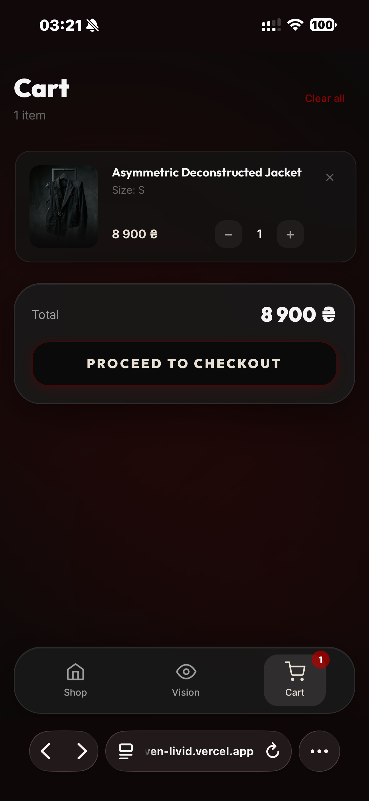
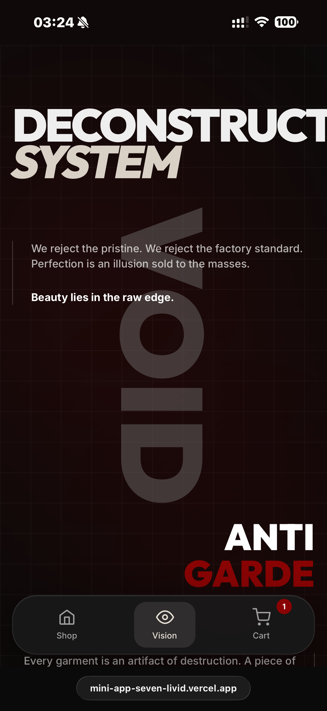

<div align="center">
  

  <h3>DECONSTRUCT. RECONSTRUCT. TRANSCEND.</h3>
  <p><i>A Premium Avant-Garde E-Commerce Experience for Telegram</i></p>

## 📱 HIGH-FIDELITY PROTOTYPE

<table align="center" style="border-collapse: separate; border-spacing: 10px;">
  <tr>
    <td align="center" style="border: none;"><b>Home & Marquee</b><br></td>
    <td align="center" style="border: none;"><b>Product Gallery</b><br></td>
    <td align="center" style="border: none;"><b>Filters & Navigation</b><br></td>
  </tr>
  <tr>
    <td align="center" style="border: none;"><b>Cart & Checkout</b><br></td>
    <td align="center" style="border: none;"><b>Checkout Form</b><br></td>
    <td align="center" style="border: none;"><b>Manifesto / Vision</b><br></td>
  </tr>
</table>

  <p>
    
    
    
    
  </p>

  <p>
    <a href="https://t.me/archiveshmotbot"><b>Open on Telegram</b></a> •
    <a href="https://mini-app-seven-livid.vercel.app"><b>Live Demo</b></a>
  </p>
</div>

---

## 🌑 THE VOID AESTHETIC

DECON is a deconstructed fashion catalog built as a Telegram Mini App. It rejects traditional UI patterns in favor of an **obsidian-crimson philosophy**, merging archival fashion editorial aesthetics with high-performance web engineering.

## 🛠 ENGINEERING CHALLENGES

### 1. Liquid Aurora Pipeline

A hardware-accelerated, scroll-reactive background system. Utilizing overlapping radial gradients with alpha-masking and dynamic `z-index` layering to create an atmospheric, amorphous void that breathes with user interaction.

### 2. X-Ray Blueprint Interaction

A unique technical feature that allows users to peer "inside" the garments.

- **Logic**: Implemented a custom interaction engine that differentiates between 400ms long-press (activation) and standard scrolling to prevent UI flickering.
- **Visual**: Real-time filter swapping using SVG FeTurbulence and contrast shifts.

### 3. Magnetic UI Proximity

Using **Framer Motion**, we developed a reusable `Magnetic` primitive. Action buttons (Add to Cart, Checkout) utilize continuous pointer-position tracking to create an "attraction" effect, lowering the friction for conversion through delightful micro-interaction.

### 4. Glitch State Engine

Typography transforms into a "distorted" state upon hover/interaction. This is achieved via a multi-layered CSS animation system that randomizes character offsets and RGB splits while maintaining 60fps performance.

## 🧪 SCOPE & IMPLEMENTATION

DECON is currently presented as a **High-Fidelity Interactive Prototype** designed to showcase advanced front-end capabilities, Telegram SDK integration, and avant-garde UI/UX. It serves as the visual and interactive foundation for a premium e-commerce mini-app.

### ✅ Implemented (Frontend Features)
- **Telegram Mini App Shell**: Seamless viewport integration, native closing behavior, and Haptics 2.0.
- **Global State Management**: `Zustand` 5 handling complex cart calculations and multi-tier array filtering.
- **Persistent Storage**: Shopping cart state is actively persisted to device `localStorage`.
- **Advanced Animations**: Framer Motion orchestration for page routing, spring physics, and magnetic buttons.
- **Performance**: Hardware-accelerated CSS effects (X-Ray SVG filters, Liquid Aurora background).

### 🚧 Mocked / Demo Data
- **Catalog**: Products are momentarily sourced from a static TypeScript array rather than an external database.
- **Delivery Grid**: Nova Poshta cities and branches utilize a localized mock dataset to simulate autocomplete search.
- **Checkout Dispatch**: Form submissions serialize data perfectly, but resolve to `Telegram.WebApp.sendData` and developer console logging rather than a live payment processing endpoint.

### 🛣 ROADMAP TO PRODUCTION
To transition DECON into a fully operational commercial deployment, the following integration paths are defined:
- [ ] **API Sourcing**: Migrate product and inventory initialization from the rigid `src/data` module to a dynamic asynchronous JSON/REST fetch from a Headless CMS (e.g., Strapi, Sanity).
- [ ] **Live Logistics**: Integration with the Nova Poshta API for real-time city and branch validation.
- [ ] **Telegram Bot Backend**: A dedicated webhook endpoint (Node.js/Python) to securely receive the checkout payload, generate the invoice, and coordinate with a payment gateway (e.g., Stripe, LiqPay, Telegram Stars).
- [ ] **Admin Control**: Basic dashboard architecture for order management and catalog updates.

## 🚀 INSTALLATION

```bash
# Clone the repository
git clone https://github.com/makquella/clothes-shop.git
cd clothes-shop

# Install dependencies
npm install

# Start for local development
npm run dev
```

## 🌍 DEPLOYMENT

Designed to live in the **Telegram ecosystem**. Seamlessly deploys to **Vercel** or **Netlify**. Ensure the bot Menu Button points to your production URL.

---

<div align="center">
  <p>Curated for the Archival Fashion Movement.</p>
  
</div>
